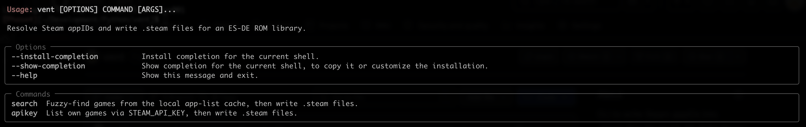

# vent

A command-line tool for creating Steam appID references for ES-DE libraries.

vent resolves game names to Steam app IDs, performs fuzzy matching against a cached Steam app list, and writes each result as a `.steam` file containing only the app ID. This keeps the workflow offline-friendly and lets ES-DE library entries point to the correct Steam title without storing any extra metadata.



---

## Overview

ES-DE expects ROM entries to have companion files alongside the game files, such as `.steam` files that contain a Steam app ID. vent helps generate those files from Steam metadata without requiring the user to manually look up IDs.

The tool is designed around a few core principles:

- Offline-first Steam app discovery via a local SQLite cache
- Fuzzy matching against the cached Steam master list
- Output written only to the project-local `output/steam` directory
- Safe filename generation for ES-DE naming conventions
- Minimal dependency footprint and a simple Typer-based CLI

---

## Features

- Search the Steam master list from a local cache using fuzzy text matching
- Populate the cache once and reuse it for repeated lookups
- Resolve app IDs for a Steam profile using the Steam Web API when an API key is available
- Write `.steam` files using the game title as a sanitized filename
- Keep generated output inside the repository instead of writing to the user’s ROM directory

---

## Requirements

- Python 3.11+
- uv (recommended for dependency and environment management)
- a Steam Web API key via the `STEAM_API_KEY` environment variable

---

## Installation

```sh
uv sync --all-groups
uv run vent --help
```

This installs the package and the development tooling used for linting, type checking, and testing.

---

## Quick Start

### 1. Search the local Steam cache

```sh
uv run vent search "portal"
```

This fuzzy-matches the query against the cached Steam app list and writes the selected result(s) to `output/steam`.

### 2. Look up games from a Steam profile

```sh
export STEAM_API_KEY="your_steam_api_key"
uv run vent apikey
```

The command prompts for a SteamID64 and looks up the profile’s owned games, then lets you select which ones to export.

---

## Output Behavior

Generated files are stored in the project-local output directory:

```text
output/
  cache/
    cache.db
  steam/
    <Sanitized-Game-Name>.steam
```

Each `.steam` file contains only the app ID, for example:

```text
105600
```

File names are sanitized to remove filesystem-invalid characters and collapse whitespace so they are safe for ES-DE and common ROM library layouts.

---

## Configuration

The project resolves settings from the repository itself, not from user ROM directories.

Environment variable:

```sh
STEAM_API_KEY
```

The loader checks this value first in the environment and then falls back to a `.env` file in the project root if present.

Important behavior:

- The app keeps cache files under the project’s `output/cache` directory
- Steam results are written under `output/steam`
- Nothing is written into the user’s ES-DE ROM folder by default

---

## Repository Layout

```text
vent/
  cli/
  config/
  output/
  scraper/
  search/
  __init__.py
  __main__.py

tests/
  fixtures/
output/
  cache/
  steam/
```

Key responsibilities:

- `vent/cli/` — Typer commands and prompts
- `vent/config/` — configuration and secret resolution
- `vent/output/` — output paths and `.steam` writing
- `vent/scraper/` — Steam API client, app list acquisition, and model types
- `vent/search/` — offline cache and fuzzy matching

---

## Development

Use the repository’s Python toolchain via uv.

### Format and lint

```sh
uv run ruff format .
uv run ruff check .
```

### Type checking

```sh
uv run mypy vent
```

### Tests

```sh
uv run pytest -q
```

### Single test selection

```sh
uv run pytest -k test_steam_filename
```

---

## Project Status

vent (v1.0.0) is a complete, offline-friendly Steam-to-ES-DE utility. The full
pipeline is implemented and covered by an offline test suite: configuration,
Steam API client, SQLite app-list cache, fuzzy search, the `.steam` writer, and
both CLI flows (`search`, `apikey`).

It runs from a source checkout via `uv run vent ...` or installs as a wheel:

```sh
uv build
uv pip install dist/vent-1.0.0-py3-none-any.whl
vent search "portal"
```

The design is intentionally minimal: one command-line interface, one local
database cache, and one output format.

---

## License

This project is licensed under the MIT License. See the repository’s `LICENSE` file for details.
